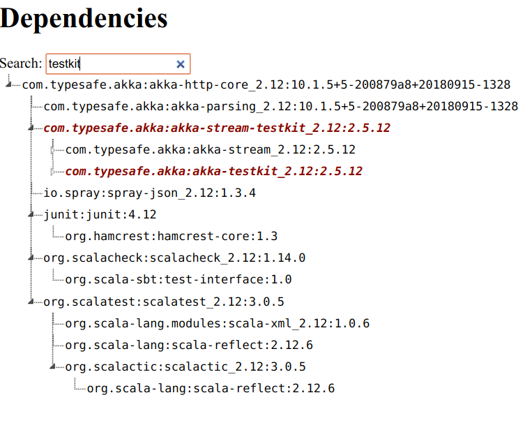

# sbt-dependency-graph

[](https://gitter.im/jrudolph/sbt-dependency-graph?utm_source=badge&utm_medium=badge&utm_campaign=pr-badge&utm_content=badge)

An sbt plugin to visualize your project's dependencies.

@@ toc { depth=1 }

## Quickstart

Use this line in `~/.sbt/1.0/plugins/plugins.sbt` to install globally or in your project's `project/plugins.sbt`:

@@@vars
```scala
addSbtPlugin("net.virtual-void" % "sbt-dependency-graph" % "$project.version$")
```
@@@

## Example Output

@ref[dependencyBrowseGraph](tasks/dependencyBrowseGraph.md):
  

@ref[dependencyBrowseTree](tasks/dependencyBrowseTree.md):



@ref[dependencyTree](tasks/dependencyTree.md):

@@snip[Example output]($root$/src/sbt-test/sbt-dependency-graph/toFileSubTask/expected/tree.txt)

@ref[whatDependsOn](tasks/whatDependsOn.md):

<script src="https://asciinema.org/a/uCm9gsowJAuCLRyRybnYHVFJ7.js" id="asciicast-uCm9gsowJAuCLRyRybnYHVFJ7" data-t="12" data-theme="solarized-dark" async></script>

@ref[dependencyList](tasks/dependencyList.md):

@@snip[Example output]($root$/src/sbt-test/sbt-dependency-graph/toFileSubTask/expected/list.txt)

@ref[dependencyStats](tasks/dependencyStats.md):

@@snip[Example output]($root$/src/sbt-test/sbt-dependency-graph/toFileSubTask/expected/stats.txt)

@ref[dependencyLicenseInfo](tasks/dependencyLicenseInfo.md):

@@snip[Example output]($root$/src/sbt-test/sbt-dependency-graph/toFileSubTask/expected/licenses.txt)


@@@ index

 * [Configuration](configuration.md)
 * [Tasks](tasks/index.md)
 * [Changelog](changelog.md)
 * [License](license.md)

@@@